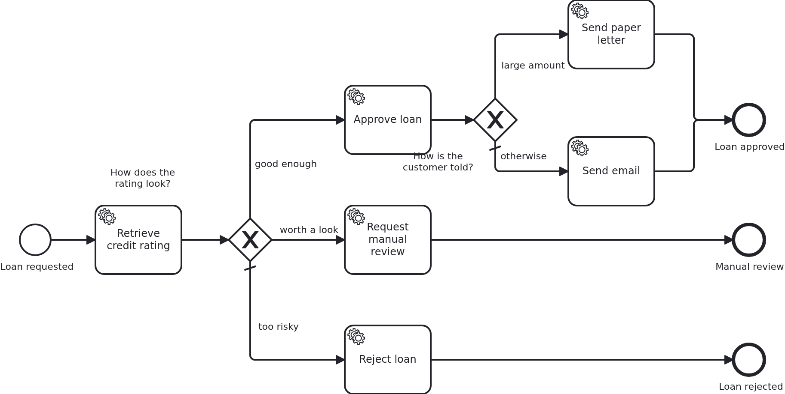

# Gateways

[](./LICENSE)

A process that always runs straight through does not need a diagram. This blueprint is
about the first fork: how a gateway decides which way to go when there are no process
variables to decide on.

## What this blueprint shows



The loan approval of the base blueprint, with two decisions in it. They are modelled
differently on purpose: **the first one the way VanillaBP recommends, the second one the way
most people write it first.** Comparing them is the point of this blueprint.

**The first gateway asks the aggregate a question.** Its conditions are `${ratedAcceptable}`
and `${ratedForManualReview}`, and those are not attributes but getters the aggregate
answers itself:

```java
public boolean isRatedAcceptable() { return "acceptable".equals(ratingBand); }
```

The model therefore knows the decisions of the process and nothing about the data behind
them. The day `ratingBand` becomes an enum, a number or three columns, this file stays as it
is - and so do the workflows already running, which is the part that hurts otherwise. The
wiki explains why at length under
[Decoupling BPMN from the data model](https://github.com/vanillabp/adapter-platform-integration/wiki/Workflow-aggregates#decoupling-bpmn-from-the-data-model),
and calls it a technique it strongly recommends.

**The second gateway reads a raw attribute**, `${amount >= 10000}`, and carries the
threshold itself. It works, it is shorter, and it is what a diagram usually looks like. What
it costs is invisible until the data model moves: the model now depends on `amount` being a
number in that unit, so the day it becomes a `Money` with a currency, every workflow
standing at this gateway needs its data migrated - a procedure the wiki calls error-prone and
worth avoiding. **Do not copy that one.** It is in here to be recognized, and the model says
so in a comment.

Two rules hold for both of them:

**Conditions read the workflow aggregate.** There are no process variables in VanillaBP, so
a condition names something in a Java class you can open, with a type and a comment.

**Conditions must not overlap.** An earlier version of this blueprint routed on two
booleans, `riskAcceptable` and `worthAManualReview`, which are both true for a good rating.
Camunda 7 then took the first branch and Camunda 8 the second, both of them entitled to.
Questions like "is this rated acceptable?" and "is this rated for a manual review?" cannot
both be true, because the aggregate answers them from one value.

The last branch of each gateway is its **default flow**, taken when no condition holds. It is
what keeps a workflow from getting stuck at a gateway that fits nowhere.

## Delta to the base blueprint

Compared to [`module-single`](https://github.com/vanillabp-blueprints/module-single-springboot):

|            File            |                                            What is different                                            |
|----------------------------|---------------------------------------------------------------------------------------------------------|
| `loan_approval.bpmn`       | two exclusive gateways, each with a default flow: one asking the aggregate, one reading a raw attribute |
| `Aggregate.java`           | `ratingBand` and the two getters the first gateway asks, plus what the branches write                   |
| `Service.java`             | turns the rating into a band, and one method per branch                                                 |
| `WorkflowTaskHandler.java` | a `@WorkflowTask` method per branch                                                                     |
| `loan-approval.yaml`       | the two thresholds the bands are derived from                                                           |
| `LoanApprovalIT.java`      | one test per branch, steered by the amount                                                              |

The conditions differ between the two BPMS, and that is the one place where they have to:
Camunda 7 evaluates `${ratedAcceptable}`, Camunda 8 the FEEL expression `=ratedAcceptable`.
Both ask the same aggregate the same question, and no line of Java knows about either. On a
remote engine the answer travels as a process variable, so the getters are shared with the
cluster like any other attribute - the pattern costs nothing there.

## Running it

Requires a JDK 21. Camunda 7 is embedded, so nothing else has to run:

```bash
mvn install verify
```

Running it on another BPMS is a Maven profile, not one line of Java changes:

```bash
mvn install verify -Pcamunda8
```

Camunda 8 is a remote engine, so a cluster has to run. Start one; its address, and everything
else specific to that engine, lives in its profile file
`application/src/main/resources/application-camunda8.yaml`, with a copy for the module's own
test:

```yaml
vanillabp:
  adapters:
    camunda8:
      # Camunda 8 is a remote engine: point this at your cluster.
      rest-address: http://localhost:8080
```

That file is loaded because the Maven profile `camunda8` sets the Spring profile of the same
name, so the engine is chosen once, on the Maven command line, and the build, the tests and
`spring-boot:run` all follow it.

Start the application:

```bash
mvn -pl application spring-boot:run
```

Booting logs a warning per workflow module: both Camunda adapters start out with
`name-clash-avoidance: none`, so nothing keeps the identifiers of one workflow module apart
from those of another, and the adapter asks for a decision instead of picking one. One module
cannot collide with itself, so this blueprint leaves it at that. Answering the question is one
property, `vanillabp.adapters.<id>.accept-unscoped-identifiers: true`, and the modes a BPMS
offers are in
[the wiki](https://github.com/vanillabp/adapter-platform-integration/wiki/Workflow-modules#how-name-clashes-are-avoided).

The amount decides which branch is taken, so this is the URL to play with:

```
http://localhost:8080/api/loan-approval/start?amount=5000
```

An amount of 5000 is a rating of 50, which is at or above the configured minimum of 30. The
second gateway then decides how the customer hears about it:

```
Loan approval '0f7c…' started
Credit rating of loan approval '0f7c…' is 50, which counts as 'acceptable'
Loan approval '0f7c…' was approved
The customer of loan approval '0f7c…' gets an email
```

50000 is approved as well, but takes the other branch of the second gateway, the one whose
condition compares the amount in the model:

```
Loan approval '3e5a…' was approved
The customer of loan approval '3e5a…' gets a paper letter
```

1500 gives a rating of 15 - below the minimum, but a person should still look at it:

```
Credit rating of loan approval '4b21…' is 15, which counts as 'review'
Loan approval '4b21…' goes to a manual review
```

300 gives a rating of 3, which fits no condition, so the default flow is taken:

```
Credit rating of loan approval '9d02…' is 3, which counts as 'too-low'
Loan approval '9d02…' was rejected
```

Both thresholds are in the module's own configuration
(`loan-approval/src/main/resources/loan-approval/loan-approval.yaml`). Move them and the
same amounts end up somewhere else, without the model being touched.

While the application runs on Camunda 7, Camunda's own web applications are served at

```
http://localhost:8080/camunda
```

Log in with `demo` / `demo`. Cockpit shows which branch an instance took, which is the
quickest way to see a gateway decision from the outside. The user comes from
`application/src/main/resources/application-camunda7.yaml` and exists so that the
blueprint can be operated without setting one up; an application with an identity provider
of its own leaves that section out.

The Camunda 8 profile brings neither the dependency nor those settings into effect. Its
tooling is part of the cluster, and the file naming a Camunda 7 adapter id is simply not
loaded there - a profile file applies to its own engine and to no other. Naming an adapter
id whose adapter is not on the classpath is a configuration error VanillaBP refuses to
start with, and the profiles are what keeps that from happening.

## How it works

|                                          File                                          |                                              Role                                              |
|----------------------------------------------------------------------------------------|------------------------------------------------------------------------------------------------|
| `loan-approval/src/main/resources/loan-approval/processes/camunda7/loan_approval.bpmn` | the process: two exclusive gateways, one asking the aggregate and one reading a raw attribute  |
| `.../loanapproval/Service.java`                                                        | turns the rating into a band using the configured thresholds, and does the work of each branch |
| `.../loanapproval/model/Aggregate.java`                                                | `ratingBand`, which the conditions read, and `outcome`, which says where the workflow ended    |
| `.../loanapproval/WorkflowTaskHandler.java`                                            | one `@WorkflowTask` method per branch, each of them forwarding to `Service`                    |
| `loan-approval/src/main/resources/loan-approval/loan-approval.yaml`                    | the thresholds, which is where a number like "30" belongs                                      |
| `loan-approval/src/test/.../LoanApprovalIT.java`                                       | one test per branch, each one steered by the amount alone                                      |

The order of events: `Service#assessCreditRating` writes the rating and the band, VanillaBP
saves the aggregate when the task handler returns, and the BPMS then evaluates the
conditions of the gateway. On an embedded engine the condition reads the aggregate directly;
on a remote one it reads what VanillaBP shared with the cluster when the task was completed.
Neither is visible in the model, which is why the same BPMN works on both once the
expression syntax matches the engine.

A gateway needs nothing from the application beyond the attribute it reads. There is no
`ProcessService` call in this blueprint apart from starting the workflow, and no handler
knows that a gateway exists.

## Documentation

- [Decoupling BPMN from the data model](https://github.com/vanillabp/adapter-platform-integration/wiki/Workflow-aggregates#decoupling-bpmn-from-the-data-model): the pattern the first gateway follows, and what the second one costs
- [Workflow aggregates](https://github.com/vanillabp/adapter-platform-integration/wiki/Workflow-aggregates): why there are no process variables, and what a condition can read
- [Wire up an expression](https://github.com/vanillabp/spi-for-java#wire-up-an-expression): how an expression in the model reaches your data
- [Sharing workflow-aggregate data](https://github.com/vanillabp/adapter-platform-integration/wiki/Workflow-aggregates#fine-grained-control-over-attributes-synchronized-to-the-bpms): what a remote engine gets to see, and how to keep an attribute out of it
- the wiki of the [BPMS adapter](https://github.com/vanillabp/adapter-platform-integration/wiki/BPMS-adapters) you use: the expression language of that engine

This blueprint is developed in the monorepo
[`blueprints`](https://github.com/vanillabp-blueprints/blueprints). This repository is a
read-only mirror, **issues and pull requests belong there.**

## Noteworthy & Contributors

[VanillaBP](https://www.github.com/vanillabp/spi-for-java) was developed by [Phactum](https://www.phactum.at) with the
intention of giving back to the community as it has benefited the community in the past.


## License

Copyright 2026 Phactum Softwareentwicklung GmbH

Licensed under the Apache License, Version 2.0
